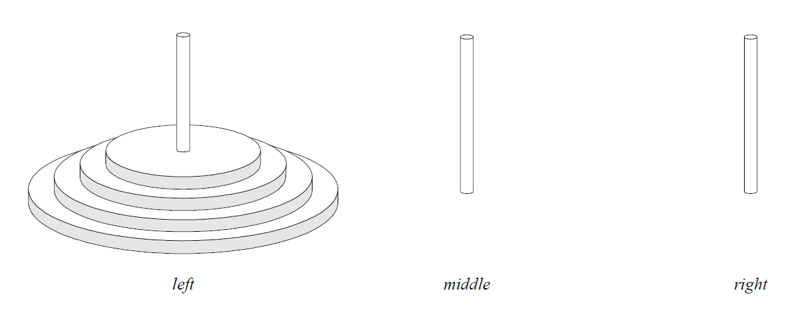

# Η γλώσσα Tony

### 20 Μαρτίου 2026

> *I call it my billion-dollar mistake. It was the invention of
> the null reference in 1965. At that time, I was designing the
> first comprehensive type system for references in an object
> oriented language (ALGOL W). My goal was to ensure
> that all use of references should be absolutely safe, with
> checking performed automatically by the compiler. But I
> couldn't resist the temptation to put in a null reference,
> simply because it was so easy to implement. This has
> led to innumerable errors, vulnerabilities, and system
> crashes, which have probably caused a billion dollars of
> pain and damage in the last forty years.*
>
> *— Tony Hoare*

<div align="center">
  
</div>

***Figure 1:** Sir Charles Antony
Richard Hoare (1934-2026). Αποδέκτης
βραβείου Turing (1980) για
τις θεμελιώδεις συνεισφορές του
στον ορισμό και τη σχεδίαση των
γλωσσών προγραμματισμού.*

---

## ΘΕΜΑ

Να σχεδιαστεί και να υλοποιηθεί από ομάδα δύο φοιτητών/τριών
ένας μεταγλωττιστής για τη γλώσσα Tony. Γλώσσα υλοποίησης
μπορεί να είναι μια από τις C ή Java. Η επιλογή κάποιας
άλλης γλώσσας υλοποίησης μπορεί να γίνει κατόπιν συνεννόησης.
Επιτρέπεται να χρησιμοποιηθούν και επίσης συνιστάται η χρήση
εργαλείων, π.χ. `flex`, `bison`, `JFlex`, `JavaCUP`, κ.λπ. Περισσότερες
πληροφορίες σχετικά με κάποια από τα εργαλεία θα δοθούν στα
εργαστήρια.

### Παραδοτέα, ημερομηνίες και βαθμολόγηση

Τα τμήματα του μεταγλωττιστή φαίνονται στον παρακάτω πίνακα.

| *Τμήμα του μεταγλωττιστή*         | *Μονάδες* | *Ημ/νία παράδοσης* |
|:----------------------------------|:---------:|:-------------------|
| Λεκτική ανάλυση                   |    1.5    | 5 Απριλίου 2026    |
| Συντακτική ανάλυση                |    2.0    | 19 Απριλίου 2026   |
| Σημασιολογική - Έλεγχος εμβελειών |    1.5    | 17 Μαΐου 2026      |
| Σημασιολογική - Έλεγχος τύπων     |    1.5    | 31 Μαΐου 2026      |
| Παραγωγή κώδικα                   |    3.5    | 1 Ιουλίου 2026     |
| *Συνολική εργασία*                |   10.0    |                    |

Για τα διάφορα τμήματα της εργασίας πρέπει να παραδίδεται
εμπρόθεσμα από κάθε ομάδα ο αντίστοιχος κώδικας σε ηλεκτρονική
μορφή, καθώς και σαφείς οδηγίες για την παραγωγή ενός
εκτελέσιμου προγράμματος επίδειξης της λειτουργίας του αντίστοιχου
τμήματος, από τον κώδικα αυτόν. Η μορφή και τα περιεχόμενα
των παραδοτέων, συμπεριλαμβανομένης και της τελικής
έκθεσης, πρέπει να συμφωνούν με τις οδηγίες που δίνονται στην
ενότητα 4 του παρόντος.

---

## Περιεχόμενα

[**1 - Περιγραφή της γλώσσας Tony**](#sec-1)<br>
&nbsp;&nbsp;&nbsp;&nbsp;[1.1 - Λεκτικές μονάδες](#sec-1-1)<br>
&nbsp;&nbsp;&nbsp;&nbsp;[1.2 - Τύποι δεδομένων](#sec-1-2)<br>
&nbsp;&nbsp;&nbsp;&nbsp;[1.3 - Δομή του προγράμματος](#sec-1-3)<br>
&nbsp;&nbsp;&nbsp;&nbsp;&nbsp;&nbsp;&nbsp;&nbsp;[1.3.1 - Μεταβλητές](#sec-1-3-1)<br>
&nbsp;&nbsp;&nbsp;&nbsp;&nbsp;&nbsp;&nbsp;&nbsp;[1.3.2 - Δομικές μονάδες](#sec-1-3-2)<br>
&nbsp;&nbsp;&nbsp;&nbsp;[1.4 - Εκφράσεις](#sec-1-4)<br>
&nbsp;&nbsp;&nbsp;&nbsp;&nbsp;&nbsp;&nbsp;&nbsp;[1.4.1 - L-values](#sec-1-4-1)<br>
&nbsp;&nbsp;&nbsp;&nbsp;&nbsp;&nbsp;&nbsp;&nbsp;[1.4.2 - Σταθερές](#sec-1-4-2)<br>
&nbsp;&nbsp;&nbsp;&nbsp;&nbsp;&nbsp;&nbsp;&nbsp;[1.4.3 - Τελεστές](#sec-1-4-3)<br>
&nbsp;&nbsp;&nbsp;&nbsp;&nbsp;&nbsp;&nbsp;&nbsp;[1.4.4 - Κλήση δομικών μονάδων ως συναρτήσεων](#sec-1-4-4)<br>
&nbsp;&nbsp;&nbsp;&nbsp;[1.5 - Εντολές](#sec-1-5)<br>
&nbsp;&nbsp;&nbsp;&nbsp;[1.6 - Βιβλιοθήκη έτοιμων συναρτήσεων](#sec-1-6)<br>
&nbsp;&nbsp;&nbsp;&nbsp;&nbsp;&nbsp;&nbsp;&nbsp;[1.6.1 - Είσοδος και έξοδος](#sec-1-6-1)<br>
&nbsp;&nbsp;&nbsp;&nbsp;&nbsp;&nbsp;&nbsp;&nbsp;[1.6.2 - Συναρτήσεις μετατροπής](#sec-1-6-2)<br>
&nbsp;&nbsp;&nbsp;&nbsp;&nbsp;&nbsp;&nbsp;&nbsp;[1.6.3 - Συναρτήσεις διαχείρισης συμβολοσειρών](#sec-1-6-3)<br><br>
[**2 - Πλήρης γραμματική της Tony**](#sec-2)<br><br>
[**3 - Παραδείγματα**](#sec-3)<br>
&nbsp;&nbsp;&nbsp;&nbsp;[3.1 - Πες γεια!](#sec-3-1)<br>
&nbsp;&nbsp;&nbsp;&nbsp;[3.2 - Οι πύργοι του Hanoi](#sec-3-2)<br>
&nbsp;&nbsp;&nbsp;&nbsp;[3.3 - Πρώτοι αριθμοί](#sec-3-3)<br>
&nbsp;&nbsp;&nbsp;&nbsp;[3.4 - Αντιστροφή συμβολοσειράς](#sec-3-4)<br>
&nbsp;&nbsp;&nbsp;&nbsp;[3.5 - Ταξινόμηση πίνακα με τη μέθοδο της φυσαλίδας](#sec-3-5)<br>
&nbsp;&nbsp;&nbsp;&nbsp;[3.6 - Ταξινόμηση λίστας με τη μέθοδο της διαμέρισης](#sec-3-6)<br><br>
[**4 - Οδηγίες για την παράδοση**](#sec-4)<br>

---

<a id="sec-1"></a>
## **1 - Περιγραφή της γλώσσας Tony**

Η γλώσσα Tony είναι μια απλή γλώσσα προστακτικού προγραμματισμού.
Τα κύρια χαρακτηριστικά της εν συντομία είναι τα εξής:

* Απλή δομή και σύνταξη εντολών και εκφράσεων που μοιάζει
  με αυτήν κάποιων γλωσσών σεναρίων.

* Βασικοί τύποι δεδομένων για λογικές τιμές, χαρακτήρες,
  ακέραιους αριθμούς, μονοδιάστατους πίνακες και λίστες.

* Απλές συναρτήσεις, πέρασμα κατ' αξία ή κατ' αναφορά.

* Εμβέλεια μεταβλητών όπως στην Pascal.

* Βιβλιοθήκη συναρτήσεων.

Περισσότερες λεπτομέρειες της γλώσσας δίνονται στις παραγράφους
που ακολουθούν.

<a id="sec-1-1"></a>
### 1.1 - Λεκτικές μονάδες

Οι λεκτικές μονάδες της γλώσσας Tony χωρίζονται στις παρακάτω
κατηγορίες:

* Τις *λέξεις κλειδιά*, οι οποίες είναι οι παρακάτω:

|        |         |          |        |         |
|:-------|:--------|:---------|:-------|:--------|
| `and`  | `bool`  | `char`   | `decl` | `def`   |
| `else` | `elsif` | `end`    | `exit` | `false` |
| `for`  | `head`  | `if`     | `int`  | `list`  |
| `mod`  | `new`   | `nil`    | `nil?` | `not`   |
| `or`   | `ref`   | `return` | `skip` | `tail`  |
| `true` |         |          |        |         |

* Τα *ονόματα*, τα οποία αποτελούνται από ένα γράμμα του λατινικού
  αλφαβήτου, πιθανώς ακολουθούμενο από μια σειρά
  γραμμάτων, δεκαδικών ψηφίων, χαρακτήρων υπογράμμισης
  (underscore) ή (λατινικών) ερωτηματικών. Τα ονόματα δεν
  πρέπει να συμπίπτουν με τις λέξεις κλειδιά που αναφέρθηκαν
  παραπάνω. Πεζά και κεφαλαία γράμματα θεωρούνται
  διαφορετικά.

* Τις *ακέραιες σταθερές* χωρίς πρόσημο, που αποτελούνται
  από ένα ή περισσότερα δεκαδικά ψηφία. Παραδείγματα ακέραιων
  σταθερών είναι τα ακόλουθα:

|     |      |        |         |
|:----|:-----|:-------|:--------|
| `0` | `42` | `1284` | `00200` |

* Τους *σταθερούς χαρακτήρες*, που αποτελούνται από ένα χαρακτήρα
  μέσα σε απλά εισαγωγικά. Ο χαρακτήρας αυτός
  μπορεί να είναι οποιοσδήποτε κοινός χαρακτήρας ή *ακολουθία
  διαφυγής* (escape sequence).

**Table 1:** Ακολουθίες διαφυγής (escape sequences).

| Ακολουθία διαφυγής | Περιγραφή                                                       |
|:-------------------|:----------------------------------------------------------------|
| `\n`               | ο χαρακτήρας αλλαγής γραμμής (line feed)                        |
| `\t`               | ο χαρακτήρας στηλοθέτησης (tab)                                 |
| `\r`               | ο χαρακτήρας επιστροφής στην αρχή της γραμμής (carriage return) |
| `\0`               | ο χαρακτήρας με ASCII κωδικό 0                                  |
| `\\`               | ο χαρακτήρας \ (backslash)                                      |
| `\'`               | ο χαρακτήρας ' (απλό εισαγωγικό)                                |
| `\"`               | ο χαρακτήρας " (διπλό εισαγωγικό)                               |
| `\xnn`             | ο χαρακτήρας με ASCII κωδικό nn στο δεκαεξαδικό σύστημα         |

  Κοινοί χαρακτήρες είναι
  όλοι οι εκτυπώσιμοι χαρακτήρες πλην των απλών και διπλών
  εισαγωγικών και του χαρακτήρα `\` (backslash). Οι ακολουθίες
  διαφυγής ξεκινούν με το χαρακτήρα `\` (backslash)
  και περιγράφονται στον πίνακα 1. Παραδείγματα σταθερών
  χαρακτήρων είναι οι ακόλουθες:

|       |       |        |        |          |
|:------|:------|:-------|:-------|:---------|
| `'a'` | `'1'` | `'\n'` | `'\''` | `'\x1d'` |

* Τις *σταθερές συμβολοσειρές*, που αποτελούνται από μια ακολουθία
  κοινών χαρακτήρων ή ακολουθιών διαφυγής μέσα
  σε διπλά εισαγωγικά. Οι συμβολοσειρές δεν μπορούν να εκτείνονται
  σε περισσότερες από μια γραμμές προγράμματος.
  Παραδείγματα σταθερών συμβολοσειρών είναι οι ακόλουθες:

|         |              |                    |                                             |
|:--------|:-------------|:-------------------|:--------------------------------------------|
| `"abc"` | `"Route 66"` | `"Hello world!\n"` | `"Name:\t\"Douglas Adams\"\n Value:\t42\n"` |

* Τους *συμβολικούς τελεστές*, οι οποίοι είναι οι παρακάτω:

|     |      |      |     |     |     |      |     |
|:----|:-----|:-----|:----|:----|:----|:-----|:----|
| `+` | `-`  | `*`  | `/` | `#` | `=` | `<>` | `<` |
| `>` | `<=` | `>=` |     |     |     |      |     |

* Τους *διαχωριστές*, οι οποίοι είναι οι παρακάτω:

|     |     |     |     |     |     |     |      |
|:----|:----|:----|:----|:----|:----|:----|:-----|
| `(` | `)` | `[` | `]` | `,` | `;` | `:` | `:=` |

Εκτός από τις λεκτικές μονάδες που προαναφέρθηκαν, ένα πρόγραμμα
Tony μπορεί επίσης να περιέχει τα παρακάτω, τα οποία
διαχωρίζουν λεκτικές μονάδες και αγνοούνται:

* *Κενούς χαρακτήρες*, δηλαδή ακολουθίες αποτελούμενες από
  κενά διαστήματα (space), χαρακτήρες στηλοθέτησης (tab),
  χαρακτήρες αλλαγής γραμμής (line feed) ή χαρακτήρες επιστροφής
  στην αρχή της γραμμής (carriage return).

* *Σχόλια μιας γραμμής*, τα οποία αρχίζουν με το χαρακτήρα `%`
  και τερματίζονται με το τέλος της τρέχουσας γραμμής.

* *Σχόλια πολλών γραμμών*, τα οποία αρχίζουν με την ακολουθία
  χαρακτήρων `<*` και τερματίζονται με την ακολουθία
  χαρακτήρων `*>`. Τα σχόλια αυτής της μορφής επιτρέπεται
  να είναι φωλιασμένα.

<a id="sec-1-2"></a>
### 1.2 - Τύποι δεδομένων

Η Tony υποστηρίζει τρεις βασικούς τύπους δεδομένων:

* `int`: ακέραιοι αριθμοί μεγέθους τουλάχιστον 16 bit (`-32768`
  έως `32767`),

* `char`: χαρακτήρες, και

* `bool`: λογικές τιμές.

Εκτός από τους βασικούς τύπους, η Tony υποστηρίζει επίσης δύο
σύνθετους τύπους:

* πίνακες, που συμβολίζονται με $t$[ ], όπου $t$ έγκυρος τύπος,
  και

* λίστες, που συμβολίζονται με `list`[ $t$ ], όπου $t$ έγκυρος τύπος.

Οι πίνακες και οι λίστες στην Tony έχουν σημασιολογία αναφοράς:
με ανάθεση και με πέρασμα παραμέτρου ποτέ δεν αντιγράφονται
τα περιεχόμενα ενός πίνακα ή μίας λίστας, αλλά απλώς αντιγράφεται
η διεύθυνση της μνήμης όπου είναι αποθηκευμένος ο πίνακας
ή η λίστα. Το σύστημα χρόνου εκτέλεσης αναλαμβάνει την αυτόματη
αποδέσμευση των πινάκων και των λιστών, υλοποιώντας
κάποιον αλγόριθμο συλλογής σκουπιδιών.

<a id="sec-1-3"></a>
### 1.3 - Δομή του προγράμματος

Η γλώσσα Tony είναι μια δομημένη (block structured) γλώσσα.
Ένα πρόγραμμα έχει χοντρικά την ίδια δομή με ένα πρόγραμμα
Pascal. Οι δομικές μονάδες μπορούν να είναι φωλιασμένες η μία
μέσα στην άλλη και οι κανόνες εμβέλειας είναι οι ίδιοι με αυτούς
της Pascal. Το κύριο πρόγραμμα είναι μία δομική μονάδα που δεν
επιστρέφει αποτέλεσμα και δε δέχεται παραμέτρους.

Κάθε δομική μονάδα μπορεί να περιέχει προαιρετικά:

* Δηλώσεις μεταβλητών.

* Ορισμούς υποπρογραμμάτων.

* Δηλώσεις υποπρογραμμάτων, οι ορισμοί των οποίων θα
  ακολουθήσουν.

<a id="sec-1-3-1"></a>
#### 1.3.1 - Μεταβλητές

Οι δηλώσεις μεταβλητών ξεκινούν με τον τύπο. Ακολουθούν
ένα ή περισσότερα ονόματα μεταβλητών, χωρισμένα με κόμματα.
Παραδείγματα δηλώσεων είναι:

```tony
int i
int x, y, z
char[] s
```

<a id="sec-1-3-2"></a>
#### 1.3.2 - Δομικές μονάδες

Ο *ορισμός* μίας δομικής μονάδας γίνεται με τη λέξη κλειδί `def`,
που ακολουθείται από την επικεφαλίδα της δομικής μονάδας, τις
τοπικές δηλώσεις και το σώμα της. Στην επικεφαλίδα αναφέρεται
ο τύπος επιστροφής (προαιρετικά), το όνομα της δομικής μονάδας
και οι τυπικές της παράμετροι (προαιρετικά). Ο τύπος επιστροφής
παραλείπεται για τις δομικές μονάδες που δεν επιστρέφουν αποτέλεσμα
(πρβλ. διαδικασίες στην Pascal). Οι τυπικές παράμετροι
γράφονται μέσα σε παρενθέσεις.

Κάθε τυπική παράμετρος χαρακτηρίζεται από το όνομά της,
τον τύπο της και τον τρόπο περάσματος. Η δήλωση των παραμέτρων
μοιάζει με εκείνη των μεταβλητών. Συνεχόμενες δηλώσεις
παραμέτρων με διαφορετικούς τύπους ή τρόπο περάσματος διαχωρίζονται
μεταξύ τους με ελληνικά ερωτηματικά (;). Η γλώσσα
Tony υποστηρίζει πέρασμα παραμέτρων κατ’ αξία (by value) και
κατ’ αναφορά (by reference). Αν η δήλωση ξεκινά με τη λέξη κλειδί
`ref`, τότε οι παράμετροι που δηλώνονται περνούν κατ’ αναφορά,
διαφορετικά περνούν κατ’ αξία.

Ακολουθούν παραδείγματα επικεφαλίδων ορισμών δομικών
μονάδων.

```tony
def p1 ()
def p2 (int n)
def p3 (int a, b; ref char c)
def int f1 (int x)
def int f2 (char[] s)
def int[][] matrix_mult(int p, q, r; int[][] a, b)
```

Οι τοπικές δηλώσεις μιας δομικής μονάδας ακολουθούν την επικεφαλίδα.
Η Tony ακολουθεί τους κανόνες εμβέλειας της Pascal,
όσον αφορά στην ορατότητα των ονομάτων μεταβλητών, δομικών
μονάδων και παραμέτρων.

Στην περίπτωση αμοιβαία αναδρομικών υποπρογραμμάτων,
το όνομα ενός υποπρογράμματος χρειάζεται να εμφανιστεί πριν
τον ορισμό της. Στην περίπτωση αυτή, για να μην παραβιαστούν
οι κανόνες εμβέλειας, πρέπει να έχει προηγηθεί μια *δήλωση* της
επικεφαλίδας αυτού του υποπρογράμματος, χωρίς το σώμα του.
Αυτό γίνεται με τη λέξη κλειδί decl αντί της `def`.

<a id="sec-1-4"></a>
#### 1.4 - Εκφράσεις

Κάθε έκφραση της Tony διαθέτει ένα μοναδικό τύπο και μπορεί
να αποτιμηθεί δίνοντας ως αποτέλεσμα μια τιμή αυτού του τύπου.
(Μοναδική εξαίρεση είναι η σταθερά `nil`, η οποία έχει τύπο λίστας
οποιουδήποτε τύπου.) Οι εκφράσεις διακρίνονται σε δύο κατηγορίες:
αυτές που δίνουν l-values, οι οποίες περιγράφονται στην
ενότητα 1.4.1 και αυτές που δίνουν r-values, που περιγράφονται
στις ενότητες 1.4.2 ως 1.4.4. Τα δυο αυτά είδη τιμών έχουν πάρει το
όνομά τους από τη θέση τους σε μια εντολή ανάθεσης: οι l-values
εμφανίζονται στο αριστερό μέλος της ανάθεσης ενώ οι r-values
στο δεξιό.

Οι εκφράσεις μπορούν να εμφανίζονται μέσα σε παρενθέσεις,
που χρησιμοποιούνται για λόγους ομαδοποίησης.

<a id="sec-1-4-1"></a>
#### 1.4.1 - L-values

Οι l-values αντιπροσωπεύουν αντικείμενα που καταλαμβάνουν
χώρο στη μνήμη του υπολογιστή κατά την εκτέλεση του προγράμματος
και τα οποία μπορούν να περιέχουν τιμές. Τέτοια αντικείμενα
είναι οι μεταβλητές και οι παράμετροι των δομικών μονάδων
και τα στοιχεία πινάκων. Συγκεκριμένα:

- Το όνομα μιας μεταβλητής ή μιας παραμέτρου συνάρτησης
  είναι l-value και αντιστοιχεί στο εν λόγω αντικείμενο. Ο τύπος
  της l-value είναι ο τύπος του αντίστοιχου αντικειμένου.

- Αν $e_1$ είναι μια έκφραση τύπου $t[]$ και $e_2$ είναι μια έκφραση
  τύπου `int`, τότε $e_1$[ $e_2$ ] είναι μια l-value με τύπο $t$. Αν η τιμή
  της έκφρασης $e_2$ είναι ο μη αρνητικός ακέραιος $n$ τότε αυτή η
  l-value αντιστοιχεί στο στοιχείο με δείκτη $n$ του πίνακα που
  αντιστοιχεί στην $e_1$. Η αρίθμηση των στοιχείων του πίνακα
  ξεκινά από το μηδέν. Η τιμή του $n$ δεν πρέπει να υπερβαίνει
  τα πραγματικά όρια του πίνακα.

Αν μια l-value χρησιμοποιηθεί ως έκφραση, η τιμή της είναι ίση
με την τιμή που περιέχεται στο αντικείμενο που αντιστοιχεί σε
αυτήν.

<a id="sec-1-4-2"></a>
#### 1.4.2 - Σταθερές

Στις r-values της γλώσσας Tony συγκαταλέγονται οι ακόλουθες
σταθερές:

- Οι ακέραιες σταθερές χωρίς πρόσημο, όπως περιγράφονται
  στην ενότητα 1.1. Έχουν τύπο `int` και η τιμή τους είναι ίση
  με τον μη αρνητικό ακέραιο αριθμό που παριστάνουν.

- Οι σταθεροί χαρακτήρες, όπως περιγράφονται στην ενότητα 1.1.
  Έχουν τύπο `char` και η τιμή τους είναι ίση με το
  χαρακτήρα που παριστάνουν.

- Οι σταθερές συμβολοσειρές, όπως περιγράφονται στην ενότητα 1.1.
  Έχουν τύπο `char`[]. Κάθε τέτοια έκφραση αντιστοιχεί
  σε έναν πίνακα, στον οποίο βρίσκονται αποθηκευμένοι
  οι χαρακτήρες της συμβολοσειράς. Στο τέλος του πίνακα
  αποθηκεύεται αυτόματα ο χαρακτήρας `\0'`, σύμφωνα με τη
  σύμβαση που ακολουθεί η γλώσσα C για τις συμβολοσειρές.
  Οι σταθερές συμβολοσειρές είναι το μόνο είδος σταθεράς
  τύπου πίνακα που επιτρέπεται.

- Οι λέξεις κλειδιά `true` και `false`, που έχουν τύπο `bool`.

- Η λέξη κλειδί `nil`, που παριστάνει την κενή λίστα και έχει
  τύπο `list`[ $t$ ] για κάθε έγκυρο τύπο $t$.

<a id="sec-1-4-3"></a>
#### 1.4.3 - Τελεστές

Οι τελεστές της Tony διακρίνονται σε τελεστές με ένα ή δύο
τελούμενα. Οι τελεστές με ένα τελούμενο γράφονται πριν από αυτό
(prefix), ενώ οι τελεστές με δύο τελούμενα γράφονται πάντα μεταξύ
των τελουμένων (infix). Η αποτίμηση των τελουμένων γίνεται από
αριστερά προς τα δεξιά. Οι τελεστές με δύο τελούμενα αποτιμούν
υποχρεωτικά και τα δύο τελούμενα, με εξαίρεση τους τελεστές `and`
και `or`, όπως περιγράφεται παρακάτω. Υπάρχουν επίσης τέσσερις
τελεστές με ειδική σύνταξη. Όλοι οι τελεστές της Tony έχουν ως
αποτέλεσμα r-value.

- Οι τελεστές με ένα τελούμενο `+` και `-` υλοποιούν τους τελεστές
  προσήμου. Το τελούμενο πρέπει να είναι έκφραση
  τύπου `int` και το αποτέλεσμα είναι r-value του ίδιου τύπου.

- Ο τελεστής με ένα τελούμενο `not` υλοποιεί τη λογική άρνηση.
  Το τελούμενο πρέπει να είναι έκφραση τύπου `bool` και το
  ίδιο είναι το αποτέλεσμά του.

- Οι τελεστές με δύο τελούμενα `+`, `-`, `*`, `/` και `mod` υλοποιούν τις
  αριθμητικές πράξεις. Τα τελούμενα πρέπει να είναι εκφράσεις
  τύπου `int` και το αποτέλεσμα είναι r-value του ίδιου
  τύπου.

- Οι τελεστές `=`, `<>`, `<`, `>`, `<=` και `>=` υλοποιούν τις σχέσεις σύγκρισης
  μεταξύ βασικών τύπων. Τα τελούμενα πρέπει να
  είναι εκφράσεις του ίδιου βασικού τύπου $t$ και το αποτέλεσμα
  είναι τύπου `bool`.

- Οι τελεστές `and` και `or` υλοποιούν αντίστοιχα τις πράξεις
  της λογικής σύζευξης και διάζευξης. Τα τελούμενα πρέπει
  να είναι εκφράσεις τύπου `bool` και το ίδιο είναι και το αποτέλεσμα.
  Η αποτίμηση συνθηκών που χρησιμοποιούν αυτούς
  τους τελεστές γίνεται με βραχυκύκλωση (short-circuit).

**Table 2:** Προτεραιότητα και προσεταιριστικότητα των τελεστών της Tony.

| Τελεστές                        | Περιγραφή                  | Αριθμός τελουμένων | Θέση και προσεταιριστικότητα |
|:--------------------------------|:---------------------------|:------------------:|:-----------------------------|
| `+`, `-`                        | Πρόσημα                    |         1          | prefix                       |
| `*`, `/`, `mod`                 | Πολλαπλασιαστικοί τελεστές |         2          | infix, αριστερή              |
| `+`, `-`                        | Προσθετικοί τελεστές       |         2          | infix, αριστερή              |
| `#`                             | Κατασκευή λίστας           |         2          | infix, δεξιά                 |
| `=`, `<>`, `<`, `>`, `<=`, `>=` | Σχεσιακοί τελεστές         |         2          | infix, καμία                 |
| `not`                           | Λογική άρνηση              |         1          | prefix                       |
| `and`                           | Λογική σύζευξη             |         2          | infix, αριστερή              |
| `or`                            | Λογική διάζευξη            |         2          | infix, αριστερή              |

  Δηλαδή, αν το αποτέλεσμα της συνθήκης είναι γνωστό από
  την αποτίμηση και μόνο του πρώτου τελούμενου, το δεύτερο
  τελούμενο δεν αποτιμάται καθόλου.

- Ο τελεστής `#` υλοποιεί την κατασκευή μη κενής λίστας (cons).
  Το πρώτο τελούμενο πρέπει να είναι έκφραση κάποιου έγκυρου
  τύπου $t$ — η κεφαλή — και το δεύτερο τελούμενο πρέπει
  να είναι έκφραση τύπου `list`[ $t$ ] — η ουρά. Το αποτέλεσμα
  είναι επίσης τύπου `list`[ $t$ ].

- Οι τελεστές με ένα τελούμενο `nil?`, `head` και `tail` υλοποιούν
  τρεις βασικές πράξεις λιστών. Η σύνταξή τους μοιάζει με
  κλήση συναρτήσεων. Το τελούμενο γράφεται μέσα σε παρενθέσεις
  και πρέπει να είναι τύπου `list`[ $t$ ], για κάποιον
  έγκυρο τύπο $t$. Ο τελεστής `nil?` επιστρέφει αποτέλεσμα τύπου
  `bool`: ελέγχει αν μια λίστα είναι κενή ή όχι. Ο τελεστής
  `head` επιστρέφει αποτέλεσμα τύπου $t$: την κεφαλή της λίστας.
  Ο τελεστής `tail` επιστρέφει αποτέλεσμα τύπου `list`[ $t$ ]: την
  ουρά της λίστας. Οι τελεστές `head` και `tail` δεν πρέπει να
  καλούνται με λίστες οι οποίες είναι κενές.

- Ο τελεστής `new` χρησιμοποιείται για τη δημιουργία πινάκων
  και έχει την ειδική σύνταξη `new` $t$[ $e$ ]. Το $t$ πρέπει να είναι
  ένας έγκυρος τύπος και η έκφραση $e$ πρέπει να έχει τύπο
  `int`. Η τιμή της $e$ πρέπει να είναι κάποιος θετικός ακέραιος
  $n$. Το αποτέλεσμα έχει τύπο $t$[ ] και είναι ένας νέος πίνακας
  $n$ στοιχείων, των οποίων οι αρχικές τιμές είναι απροσδιόριστες.

Στον πίνακα 2 ορίζεται η προτεραιότητα και η προσεταιριστικότητα
των τελεστών της Tony. Οι γραμμές που βρίσκονται
υψηλότερα στον πίνακα περιέχουν τελεστές μεγαλύτερης προτεραιότητας.
Τελεστές που βρίσκονται στην ίδια γραμμή έχουν
την ίδια προτεραιότητα. Οι τελεστές `nil?`, `head`, `tail` και `new`, που
έχουν ειδική σύνταξη, δε συμπεριλαμβάνονται στον πίνακα.

<a id="sec-1-4-4"></a>
#### 1.4.4 - Κλήση δομικών μονάδων ως συναρτήσεων

Αν $f$ είναι το όνομα μιας δομικής μονάδας με υπαρκτό τύπο
επιστροφής $t$, τότε η έκφραση $f$($e_1$, … , $e_n$) είναι μια r-value με τύπο
$t$. Ο αριθμός των πραγματικών παραμέτρων $n$ πρέπει να συμπίπτει
με τον αριθμό των τυπικών παραμέτρων της $f$. Επίσης, ο τύπος
και το είδος κάθε πραγματικής παραμέτρου πρέπει να συμπίπτει
με τον τύπο και τον τρόπο περάσματος της αντίστοιχης τυπικής
παραμέτρου, σύμφωνα με τους παρακάτω κανόνες.

- Αν η τυπική παράμετρος είναι τύπου $t$ και περνά κατ’ αξία,
  τότε η αντίστοιχη πραγματική παράμετρος πρέπει να είναι
  έκφραση τύπου $t$.

- Αν η τυπική παράμετρος είναι τύπου $t$ και περνά κατ’ αναφορά,
  τότε η αντίστοιχη πραγματική παράμετρος πρέπει να
  είναι l-value τύπου $t$.

Κατά την κλήση μιας δομικής μονάδας, οι πραγματικές παράμετροι
αποτιμώνται από αριστερά προς τα δεξιά.

<a id="sec-1-5"></a>
#### 1.5 - Εντολές

Οι εντολές που υποστηρίζει η γλώσσα Tony χωρίζονται σε
απλές και σύνθετες. Οι απλές εντολές είναι οι ακόλουθες:

- Η κενή εντολή `skip` που δεν κάνει καμία ενέργεια.

- Η εντολή ανάθεσης $l$ := $e$ που αναθέτει την τιμή της έκφρασης
  $e$ στην l-value $l$. Η l-value $l$ και ή έκφραση $e$ πρέπει
  να είναι του ίδιου τύπου $t$. Η l-value $l$ δεν πρέπει να αντιστοιχεί
  σε στοιχείο σταθερής συμβολοσειράς. Σύμφωνα με
  όσα γράφονται στην ενότητα 1.2, η ανάθεση πινάκων και
  λιστών αντιγράφει τη διεύθυνση ενός πίνακα ή μίας λίστας,
  δημιουργώντας συνώνυμα — ποτέ δεν αντιγράφει τα περιεχόμενα.

- Η εντολή κλήσης δομικής μονάδας. Οι πραγματικές παράμετροι
  γράφονται ανάμεσα σε παρενθέσεις. Αν είναι περισσότερες,
  χωρίζονται με κόμματα. Οι προϋποθέσεις για την
  κλήση είναι οι ίδιες όπως στην ενότητα 1.4.4 με τη διαφορά
  ότι δεν πρέπει να ορίζεται τύπος επιστροφής για τη δομική
  μονάδα.

Οι σύνθετες εντολές της Tony είναι οι εξής:

- Η εντολή ελέγχου `if` $e_1$ : $b_1$ `elsif` $e_2$ : $b_2$ `else` : $b_2$, όπου το
  σκέλος `elsif` μπορεί να επαναλαμβάνεται μηδέν ή περισσότερες
  φορές και το σκέλος `else` είναι προαιρετικό. Τα $e_1$
  και $e_2$ πρέπει να είναι έγκυρες εκφράσεις τύπου `bool`. Τα $b_1$,
  $b_2$ και $b_3$ πρέπει να είναι ακολουθίες μίας ή περισσότερων
  εντολών. Η σημασιολογία της εντολής είναι όπως π.χ. στη
  Python.

- Η εντολή ελέγχου `for` $s_1$; $e$; $s_2$ : $b$, που μοιάζει με την αντίστοιχη
  εντολή της C. Τα $s_1$ και $s_2$ είναι ακολουθίες μίας ή
  περισσότερων απλών εντολών, χωρισμένων μεταξύ τους με
  κόμματα. Το $s_1$ εκτελείται μία φορά στην έναρξη του βρόχου
  (αρχικοποίηση), ενώ το $s_2$ εκτελείται στο τέλος κάθε επανάληψης
  (βήμα). Η έκφραση $e$ πρέπει να είναι τύπου `bool` και
  παριστάνει τη συνθήκη του βρόχου: όσο η τιμή της είναι
  αληθής, ο βρόχος επαναλαμβάνεται. Το $b$ πρέπει να είναι
  ακολουθία μίας ή περισσότερων εντολών.

- Η εντολή άλματος `exit` που τερματίζει την εκτέλεση της
  τρέχουσας δομικής μονάδας. Η εντολή αυτή πρέπει να εμφανίζεται
  στο σώμα μίας δομικής μονάδας χωρίς τύπο επιστροφής.

- Η εντολή άλματος return $e$ που τερματίζει την εκτέλεση της
  τρέχουσας δομικής μονάδας και επιστρέφει ως αποτέλεσμα
  την τιμή της έκφρασης $e$. Η εντολή αυτή πρέπει να εμφανίζεται
  στο σώμα μίας δομικής μονάδας με τύπο επιστροφής $t$
  και η έκφραση $e$ πρέπει να έχει τον ίδιο τύπο $t$.

<a id="sec-1-6"></a>
#### 1.6 - Βιβλιοθήκη έτοιμων συναρτήσεων

Η Tony υποστηρίζει ένα σύνολο προκαθορισμένων δομικών
μονάδων, τις οποίες θα χρειαστεί να υλοποιήσετε στο προαιρετικό
μέρος της εργασίας. Είναι ορατές σε κάθε δομική μονάδα, εκτός
αν επισκιάζονται από μεταβλητές, παραμέτρους ή άλλες δομικές
μονάδες με το ίδιο όνομα. Παρακάτω δίνονται οι δηλώσεις τους
και εξηγείται η λειτουργία τους.

<a id="sec-1-6-1"></a>
#### 1.6.1 - Είσοδος και έξοδος

```tony
decl puti (int n)
decl putb (bool b)
decl putc (char c)
decl puts (char[] s)
```

Οι συναρτήσεις αυτές χρησιμοποιούνται για την εκτύπωση τιμών
που ανήκουν στους βασικούς τύπους της Tony, καθώς και για την
εκτύπωση συμβολοσειρών.

```tony
decl int geti ()
decl bool getb ()
decl char getc ()
decl gets (int n, char[] s)
```

Αντίστοιχα, οι παραπάνω συναρτήσεις χρησιμοποιούνται για την
εισαγωγή τιμών που ανήκουν στους βασικούς τύπους της Tony και
για την εισαγωγή συμβολοσειρών. Η συνάρτηση `gets` χρησιμοποιείται
για την ανάγνωση μιας συμβολοσειράς μέχρι τον επόμενο
χαρακτήρα αλλαγής γραμμής. Οι παράμετροι της καθορίζουν το
μέγιστο αριθμό χαρακτήρων (συμπεριλαμβανομένου του τελικού
`'\0'`) που επιτρέπεται να διαβαστούν και τον πίνακα χαρακτήρων
στον οποίο αυτοί θα τοποθετηθούν. Ο χαρακτήρας αλλαγής
γραμμής δεν αποθηκεύεται. Αν το μέγεθος του πίνακα εξαντληθεί
πριν συναντηθεί χαρακτήρας αλλαγής γραμμής, η ανάγνωση θα
συνεχιστεί αργότερα από το σημείο όπου διακόπηκε.

<a id="sec-1-6-2"></a>
#### 1.6.2 - Συναρτήσεις μετατροπής

```tony
decl int abs (int n)
decl int ord (char c)
decl char chr (int n)
```

H συνάρτηση `abs` υπολογίζει την απόλυτη τιμή ενός ακέραιου
αριθμού. Οι συναρτήσεις `ord` και `chr` μετατρέπουν από ένα χαρακτήρα
στον αντίστοιχο κωδικό ASCII και αντίστροφα.

<a id="sec-1-6-3"></a>
#### 1.6.3 - Συναρτήσεις διαχείρισης συμβολοσειρών

```tony
decl int strlen (char[] s)
decl int strcmp (char[] s1, s2)
decl strcpy (char[] trg, src)
decl strcat (char[] trg, src)
```

Οι συναρτήσεις αυτές έχουν ακριβώς την ίδια λειτουργία με τις
συνώνυμές τους στη βιβλιοθήκη συναρτήσεων της γλώσσας C.

---

<a id="sec-2"></a>
## 2 - Πλήρης γραμματική της Tony

Η σύνταξη της γλώσσας Tony δίνεται παρακάτω σε μορφή
EBNF. Η γραμματική που ακολουθεί είναι *διφορούμενη*, οι περισσότερες
αμφισημίες όμως μπορούν να ξεπερασθούν αν λάβει κανείς
υπόψη τους κανόνες προτεραιότητας και προσεταιριστικότητας
των τελεστών, όπως περιγράφονται στον πίνακα 2. Τα σύμβολα
⟨ $id$ ⟩, ⟨ $int-const$ ⟩, ⟨ $char-const$ ⟩ και ⟨ $string-literal$ ⟩ είναι τερματικά
σύμβολα της γραμματικής.

|                   |        |                                                                                                                  |
|:------------------|:------:|:-----------------------------------------------------------------------------------------------------------------|
| ⟨ $program$ ⟩     |  ::=   | ⟨ $func-def$ ⟩                                                                                                   |
| ⟨ $func-def$ ⟩    |  ::=   | “`def`” ⟨ $header$ ⟩ “:” (⟨ $func-def$ ⟩ &#124; ⟨ $func-decl$ ⟩ &#124; ⟨ $var-def$ ⟩)* ⟨ $stmt$ ⟩+ “`end`”       |
| ⟨ $header$ ⟩      |  ::=   | [ ⟨ $type$ ⟩ ] ⟨ $id$ ⟩ “`(`” [ ⟨ $formal$ ⟩ (“;” ⟨ $formal$ ⟩)* ] “`)`”                                         |
| ⟨ $formal$ ⟩      |  ::=   | [ “ $ref$ ” ] ⟨ $type$ ⟩ ⟨ $id$ ⟩ (“,” ⟨ $id$ ⟩)*                                                                  |
| ⟨ $type$ ⟩        |  ::=   | “`int`” &#124; “`bool`” &#124; “`char`” &#124; ⟨ $type$ ⟩ “`[`” “`]`” &#124; “`list`” “[” ⟨ $type$ ⟩ “]”         |
| ⟨ $func-decl$ ⟩   |  ::=   | “`decl`” ⟨ $header$ ⟩                                                                                            |
| ⟨ $var-def$ ⟩     |  ::=   | ⟨ $type$ ⟩ ⟨ $id$ ⟩ (“,” ⟨ $id$ ⟩)*                                                                              |
| ⟨ $stmt$ ⟩        |  ::=   | ⟨ $simple$ ⟩ &#124; “`exit`” &#124; “`return`” ⟨ $expr$ ⟩                                                        |
|                   | &#124; | “`if`” ⟨ $expr$ ⟩ “:” ⟨ $stmt$ ⟩+ (“`elif`” ⟨ $expr$ ⟩ “:” ⟨ $stmt$ ⟩+)* [ “`else`” “:” ⟨ $stmt$ ⟩+ ] “`end`”    |
|                   | &#124; | “`for`” ⟨ $simple-list$ ⟩ “;” ⟨ $expr$ ⟩ “;” ⟨ $simple-list$ ⟩ “:” ⟨ $stmt$ ⟩+ “`end`”                           |
| ⟨ $simple$ ⟩      |  ::=   | “`skip`” &#124; ⟨ $atom$ ⟩ “:=” ⟨ $expr$ ⟩ &#124; ⟨ $call$ ⟩                                                     |
| ⟨ $simple-list$ ⟩ |  ::=   | ⟨ $simple$ ⟩ (“,” ⟨ $simple$ ⟩)*                                                                                 |
| ⟨ $call$ ⟩        |  ::=   | ⟨ $id$ ⟩ “(” [ ⟨ $expr$ ⟩ (“,” ⟨ $expr$ ⟩)* ] “)”                                                                |
| ⟨ $atom$ ⟩        |  ::=   | ⟨ $id$ ⟩ &#124; ⟨ $string-literal$ ⟩ &#124; ⟨ $atom$ ⟩ “[” ⟨ $expr$ ⟩ “]” &#124; ⟨ $call$ ⟩                      |
| ⟨ $expr$ ⟩        |  ::=   | ⟨ $atom$ ⟩ &#124; ⟨ $int-const$ ⟩ &#124; ⟨ $char-const$ ⟩ &#124; “(” ⟨ $expr$ ⟩ “)”                              |
|                   | &#124; | ( “+” &#124; “-” ) ⟨ $expr$ ⟩ &#124; ⟨ $expr$ ⟩ (“+” &#124; “-” &#124; “*” &#124; “/” &#124; “`mod`”) ⟨ $expr$ ⟩ |
|                   | &#124; | ⟨ $expr$ ⟩ (“=” &#124; “<>” &#124; “<” &#124; “>” &#124; “<=” &#124; “>=”) ⟨ $expr$ ⟩                            |
|                   | &#124; | “`true`” &#124; “`false`” &#124; “`not`” ⟨ $expr$ ⟩ &#124; ⟨ $expr$ ⟩ (“`and`” &#124; “`or`”) ⟨ $expr$ ⟩         |
|                   | &#124; | “`new`” ⟨ $type$ ⟩ “[” ⟨ $expr$ ⟩ “]” &#124; “`nil`” &#124; “`nil?`” “(” ⟨ $expr$ ⟩ “)”                          |
|                   | &#124; | ⟨ $expr$ ⟩ “#” ⟨ $expr$ ⟩ &#124; “`head`” “(” ⟨ $expr$ ⟩ “)” &#124; “`tail`” “(” ⟨ $expr$ ⟩ “)”                  |

---

<a id="sec-3"></a>
## 3 - Παραδείγματα

Στην παράγραφο αυτή δίνονται έξι παραδείγματα προγραμμάτων
στη γλώσσα Tony, η πολυπλοκότητα των οποίων κυμαίνεται
σημαντικά.

<a id="sec-3-1"></a>
### 3.1 - Πες γεια!

Το παρακάτω παράδειγμα είναι το απλούστερο πρόγραμμα στη
γλώσσα Tony που παράγει κάποιο αποτέλεσμα ορατό στο χρήστη.
Το πρόγραμμα αυτό τυπώνει απλώς ένα μήνυμα.

```tony
def hello ():
  puts("Hello world!\n")
end
```

<a id="sec-3-2"></a>
### 3.2 - Οι πύργοι του Hanoi

Το πρόγραμμα που ακολουθεί λύνει το πρόβλημα των πύργων
του Hanoi. Μια σύντομη περιγραφή του προβλήματος δίνεται
παρακάτω.

<div align="center">
  
</div>

**Figure 2:** Οι πύργοι του Hanoi.

Υπάρχουν τρεις στύλοι, στον πρώτο από τους οποίους είναι
περασμένοι 𝑛 το πλήθος δακτύλιοι. Οι εξωτερικές διάμετροι των
δακτυλίων είναι διαφορετικές και αυτοί είναι περασμένοι από
κάτω προς τα πάνω σε φθίνουσα σειρά εξωτερικής διαμέτρου,
όπως φαίνεται στο σχήμα 2. Ζητείται να μεταφερθούν οι δακτύλιοι
από τον πρώτο στον τρίτο στύλο (χρησιμοποιώντας το δεύτερο
ως βοηθητικό χώρο), ακολουθώντας όμως τους εξής κανόνες:

- Κάθε φορά επιτρέπεται να μεταφερθεί ένας μόνο δακτύλιος,
  από κάποιο στύλο σε κάποιον άλλο στύλο.

- Απαγορεύεται να τοποθετηθεί δακτύλιος με μεγαλύτερη
  διάμετρο πάνω από δακτύλιο με μικρότερη διάμετρο.

Το πρόγραμμα στη γλώσσα Tony που λύνει αυτό το πρόβλημα
δίνεται παρακάτω. Η συνάρτηση `hanoi` είναι αναδρομική.

```tony
def solve ():

  def hanoi (int rings; char[] source, target, auxiliary):

    def move (char[] source, target):
      puts("Moving from ") puts(source) puts(" to ") puts(target) puts(".\n")
    end

    if rings >= 1:
      hanoi(rings-1, source, auxiliary, target)
      move(source, target)
      hanoi(rings-1, auxiliary, target, source)
    end
  end

  int NumberOfRings

  puts("Rings: ")
  NumberOfRings := geti()
  hanoi(NumberOfRings, "left", "right", "middle")
end
```

<a id="sec-3-3"></a>
### 3.3 - Πρώτοι αριθμοί

Το παρακάτω παράδειγμα προγράμματος στη γλώσσα Tony
είναι ένα πρόγραμμα που υπολογίζει τους πρώτους αριθμούς μεταξύ
1 και $n$, όπου το $n$ καθορίζεται από το χρήστη. Το πρόγραμμα
αυτό χρησιμοποιεί έναν απλό αλγόριθμο για τον υπολογισμό των
πρώτων αριθμών. Μια διατύπωση αυτού του αλγορίθμου σε ψευδογλώσσα
δίνεται παρακάτω. Λαμβάνεται υπόψη ότι οι αριθμοί 2
και 3 είναι πρώτοι, και στη συνέχεια εξετάζονται μόνο οι αριθμοί
της μορφής 6 $k$ ± 1, όπου $k$ φυσικός αριθμός.

**Κύριο πρόγραμμα**

τύπωσε τους αριθμούς 2 και 3<br>
για $t$ := 6 μέχρι $n$ με βήμα 6 κάνε τα εξής:<br>
&nbsp;&nbsp;&nbsp;&nbsp;αν ο αριθμός $t$ - 1 είναι πρώτος τότε τύπωσέ τον<br>
&nbsp;&nbsp;&nbsp;&nbsp;αν ο αριθμός $t$ + 1 είναι πρώτος τότε τύπωσέ τον

**Αλγόριθμος ελέγχου (είναι ο αριθμός $t$ πρώτος;)**

αν $t$ < 0 τότε έλεγξε τον αριθμό - $t$<br>
αν $t$ < 2 τότε ο 𝑡 δεν είναι πρώτος<br>
αν $t$ = 2 τότε ο $t$ είναι πρώτος<br>
αν ο $t$ διαιρείται με το 2 τότε ο $t$ δεν είναι πρώτος<br>
για $i$ ∶= 3 μέχρι $t$/2 με βήμα 2 κάνε τα εξής:<br>
&nbsp;&nbsp;&nbsp;&nbsp;αν ο $t$ διαιρείται με τον $i$ τότε ο $t$ δεν είναι πρώτος<br>
o $t$ είναι πρώτος

Το αντίστοιχο πρόγραμμα στη γλώσσα Tony είναι το ακόλουθο.

```tony
def primes ():

  def bool prime (int n):
    int i
    if n < 0: return prime(-n)
    elsif n < 2: return false
    elsif n = 2: return true
    elsif n mod 2 = 0: return false
    else:
      for i := 3; i <= n / 2; i := i+2:
        if n mod i = 0:
          return false
        end
      end
      return true
    end
  end

  int limit, number, counter

  limit := 181 % there are 42 prime numbers lower than 181
  counter := 0
  if limit >= 2: counter := counter + 1 end
  if limit >= 3: counter := counter + 1 end
  for number := 6; number <= limit; number := number + 6:
    if prime(number-1):
      counter := counter + 1
    end
    if (number <> limit) and prime(number+1):
      counter := counter + 1
    end
  end
  puti(counter)
end
```

<a id="sec-3-4"></a>
### 3.4 - Αντιστροφή συμβολοσειράς

Το πρόγραμμα που ακολουθεί στη γλώσσα Tony εκτυπώνει το
μήνυμα `“Hello world!”` αντιστρέφοντας τη δοθείσα συμβολοσειρά.

```tony
def main ():

  def char[] reverse (char[] s):
    char[] t
    int i, l

    l := strlen(s)
    t := new char[l+1]
    for i := 0; i < l; i := i+1: t[i] := s[l-i-1] end
    t[i] := '\0'
    return t
  end

  puts(reverse("\n!dlrow olleH"))
end
```

<a id="sec-3-5"></a>
### 3.5 - Ταξινόμηση πίνακα με τη μέθοδο της φυσαλίδας

Ο αλγόριθμος της φυσαλίδας (bubble sort) είναι ένας από τους
πιο γνωστούς και απλούς αλγορίθμους ταξινόμησης. Το παρακάτω
πρόγραμμα σε Tony τον χρησιμοποιεί για να ταξινομήσει
έναν πίνακα ακεραίων αριθμών κατ’ αύξουσα σειρά. Αν $x$ είναι
ο πίνακας που πρέπει να ταξινομηθεί και 𝑛 είναι το μέγεθός του
(θεωρούμε σύμφωνα με τη σύμβαση της Tony ότι τα στοιχεία του
είναι τα $x$[0], $x$[1], … $x$[ $n$ − 1 ]), μια παραλλαγή του αλγορίθμου
περιγράφεται με ψευδοκώδικα ως εξής:

**Αλγόριθμος της φυσαλίδας (bubble sort)**

επανάλαβε το εξής:<br>
&nbsp;&nbsp;&nbsp;&nbsp;για $i$ από 0 ως $n$ − 2<br>
&nbsp;&nbsp;&nbsp;&nbsp;&nbsp;&nbsp;&nbsp;&nbsp;αν $x$[𝑖] > $x$[ $i$ + 1 ]<br>
&nbsp;&nbsp;&nbsp;&nbsp;&nbsp;&nbsp;&nbsp;&nbsp;&nbsp;&nbsp;&nbsp;&nbsp;αντίστρεψε τα $x$[ $i$ ] και $x$[ $i$ + 1 ]<br>
όσο μεταβάλλεται η σειρά των στοιχείων του $x$

Το αντίστοιχο πρόγραμμα σε γλώσσα Tony είναι το εξής:

```tony
def main ():

  def bsort (int n; int[] x):

    def swap (ref int x, y):
      int t
      t := x
      x := y
      y := t
    end

    int i

    bool changed

    for changed := true; changed; skip:
      changed := false
      for i := 0; i < n-1; i := i+1:
        if x[i] > x[i+1]:
          swap(x[i], x[i+1])
          changed := true
        end
      end
    end
  end

  def writeArray (char[] msg; int n; int[] x):
    int i

    puts(msg)
    for i := 0; i < n; i := i+1:
      if i > 0: puts(", ") end
        puti(x[i])
      end
    puts("\n")
    end

  int seed, i
  int[] x

  x := new int[16]
  seed := 65
  for i := 0; i < 16; i := i+1:
    seed := (seed * 137 + 220 + i) mod 101
    x[i] := seed
  end
  writeArray("Initial array: ", 16, x)
  bsort(16, x)
  writeArray("Sorted array: ", 16, x)
end
```

<a id="sec-3-6"></a>
### 3.6 - Ταξινόμηση λίστας με τη μέθοδο της διαμέρισης

Ο αλγόριθμος της διαμέρισης (quicksort) δε θα μπορούσε φυσικά
να λείπει από το εγχειρίδιο ορισμού της γλώσσας Tony! Η
(σχεδόν) συναρτησιακή παραλλαγή του για την ταξινόμηση λιστών,
που περιγράφεται παρακάτω, είναι διαφορετική από την
προστακτική πρωτότυπη μορφή που οφείλεται στον Tony Hoare
και που ταξινομεί έναν πίνακα επί τόπου.

**Αλγόριθμος της διαμέρισης (quicksort)**

χρησιμοποίησε το πρώτο στοιχείο της λίστας ως διαμεριστή
(pivot)<br>
χώρισε τα υπόλοιπα στοιχεία της λίστας σε δύο λίστες:<br>
&nbsp;&nbsp;&nbsp;&nbsp;μία που περιέχει τα στοιχεία που είναι μικρότερα του
διαμεριστή, και<br>
&nbsp;&nbsp;&nbsp;&nbsp;μία που περιέχει τα στοιχεία που είναι μεγαλύτερα ή ίσα<br>
ταξινόμησε ξεχωριστά (αναδρομικά) τις δύο λίστες<br>
συνένωσε τα αποτελέσματα, παρεμβάλλοντας το διαμεριστή

Αντί της ξεχωριστής ταξινόμησης και συνένωσης, χρησιμοποιείται
η συνάρτηση `qsort_aux(l, r)` που ταξινομεί τη λίστα l και
συγχρόνως συνενώνει στο αποτέλεσμα τη λίστα r. Το πρόγραμμα
σε γλώσσα Tony είναι το εξής:

```tony
def main ():
  def list[int] qsort (list[int] l):
    def list[int] qsort_aux (list[int] l, rest):
      int pivot, x
      list[int] lt, ge

      if nil?(l): return rest end
      pivot := head(l)
      l := tail(l)
      for lt := nil, ge := nil; nil?(l); l := tail(l):
        x := head(l)
        if x < pivot: lt := x # lt else: ge := x # ge end
      end
      return qsort_aux(lt, pivot # qsort_aux(ge, rest))
    end
    return qsort_aux(l, nil)
  end

  def writeList (char[] msg; list[int] l):
    bool more

    puts(msg)
    for more := false; not nil?(l); l := tail(l), more := true:
      if more: puts(", ") end
      puti(head(l))
    end
    puts("\n")
  end

  int seed, i
  list[int] l

  seed := 65
  for i := 0, l := nil; i < 16; i := i+1:
    seed := (seed * 137 + 220 + i) mod 101
    l := seed # l
  end
  writeList("Initial list: ", l)
  l := qsort(l)
  writeList("Sorted list: ", l)
end
```

---

<a id="sec-4"></a>
## 4 - Οδηγίες για την παράδοση

Ο μεταγλωττιστής θα δέχεται το πηγαίο πρόγραμμα από ένα
αρχείο με οποιαδήποτε κατάληξη (πχ. `*.tony`) που θα δίνεται ως
το μοναδικό του όρισμα. Η έξοδος της σημασιολογικής ανάλυσης
θα είναι το αφηρημένο συντακτικό δέντρο που αντιστοιχεί στο
πρόγραμμα μαζί με τις αντίστοιχες πληροφορίες για κάθε κόμβο
(π.χ. τύποι μεταβλητών).

Σε περίπτωση που δεν υλοποιήσετε oλόκληρο τον μεταγλωτ-
τιστή θα πρέπει να παρέχετε σαφείς οδηγίες και εκτελέσιμο πρόγραμμα
που θα μπορεί να επιδεικνύει την λειτουργία του κάθε
τμήματος.

Η τιμή που θα επιστρέφεται στο λειτουργικό σύστημα από
το μεταγλωττιστή θα πρέπει να είναι μηδενική στην περίπτωση
επιτυχούς μεταγλώττισης και μη μηδενική σε αντίθετη περίπτωση.
